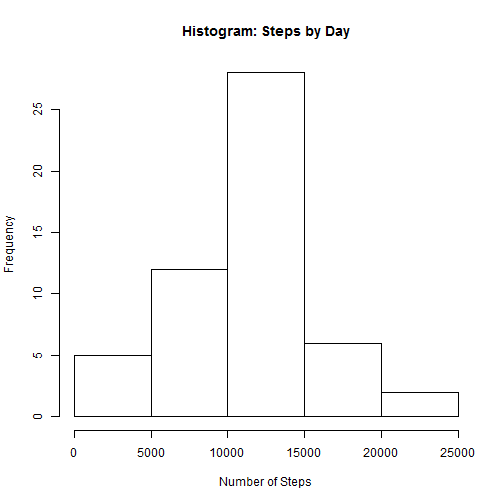
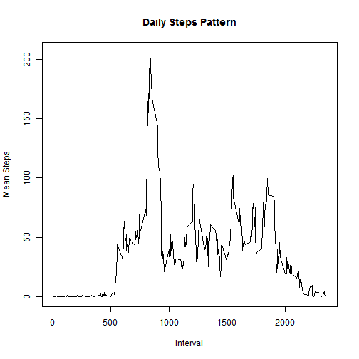

## Loading and preprocessing the data

```r
library(dplyr)
```

```
## Warning: package 'dplyr' was built under R version 3.0.3
```

```
## 
## Attaching package: 'dplyr'
## 
## The following objects are masked from 'package:stats':
## 
##     filter, lag
## 
## The following objects are masked from 'package:base':
## 
##     intersect, setdiff, setequal, union
```

```r
activity <- read.csv("activity.csv")
activity<-activity %>% mutate(date=as.Date(activity$date,format="%Y-%m-%d"))
activityByDay<-activity %>%
    na.omit() %>%
    group_by(date) %>% 
    summarise(totalSteps=sum(steps))
```
## What is mean total number of steps taken per day?

```r
hist(activityByDay$totalSteps,main="Histogram: Steps by Day",xlab="Number of Steps")
```

 

```r
meanSteps<-mean(activityByDay$totalSteps)
meanSteps
```

```
## [1] 10766.19
```

```r
medianSteps<-median(activityByDay$totalSteps)
medianSteps
```

```
## [1] 10765
```
## What is the average daily activity pattern?

```r
activityByInterval<-activity %>% 
    na.omit() %>%
    group_by(interval) %>%
    summarise(meanSteps=mean(steps))
plot(activityByInterval$interval,activityByInterval$meanSteps, type="l",
     main="Daily Steps Pattern",
     xlab="Interval",
     ylab="Mean Steps")
```

 

```r
maxSteps<-activityByInterval %>% filter(meanSteps==max(activityByInterval$meanSteps))
maxSteps$interval
```

```
## [1] 835
```

## Inputing missing values

Not completed.

## Are there differences in activity patterns between weekdays and weekends?

Not completed.
